# UmScanGalactiK: an open source code for the unsupervised classification of kinematic morphologies of galaxies

UmScanGalactiK is a method that automatically classifies kinematic maps of galaxies by combining dimensionality reduction (UMAP) and clustering (HDBSCAN) algorithms. This method has been proven to yield a meaningful classification when fed with kinematic maps built from stellar particle information from a cosmological numerical simulation of the EAGLE project. The kinematic maps mimic images obtained through integral-field spectroscopy techniques.

Please, if you use UmScanGalactiK, cite our publication: [BibTeX](https://ui.adsabs.harvard.edu/abs/2022arXiv221203999R/exportcitation). If you like this repository, consider giving it a star.

## UmScanGalactiK code and example

In this repository, an implementation of UmScanGalactiK is presented along with a concrete example demonstrating its applicability and usefulness. This limited example aims to illustrate the method and the subsequent statistical analysis of data-driven clustering required to draw robust conclusions. I provide the particular input needed to reproduce three panels of Fig. 6. of Rosito et al. (2022), publicated in Astronomy & Astrophysics (see below) and to obtain some of the results in Sec. 5 of the same publication. The input consists of a set of kinematic maps for galaxies observed at 90 degrees inclinations and the values of their triaxiality parameter, $T$. The ouput includes the unsupervised groups obtained through UmScanGalactiK and the analysis of the distributions of $T$ within the clusters and the quantitative comparison between two of these distributions.

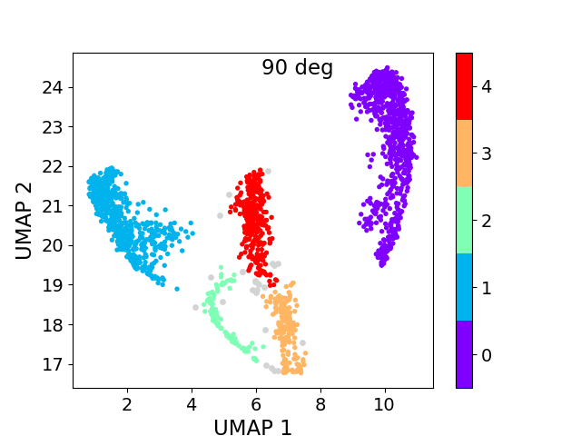 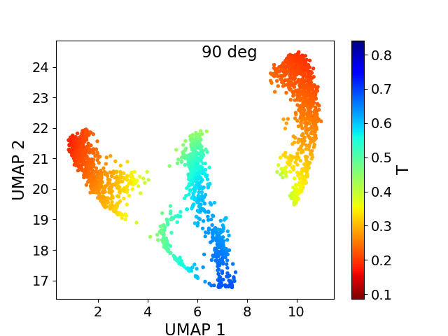 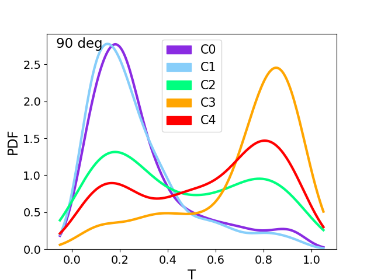

## Instructions to run the example

1. Download this repository
2. Install specific libraries
    - UMAP installation instructions: https://pypi.org/project/umap-learn/
    - HDBSCAN installation instructions: https://pypi.org/project/hdbscan/
    - loess: I include in the folder "src" the version of loess that I am using to smooth the scatter plots. For information on the current version of this library, check the following link: https://pypi.org/project/loess/
3. Run the "example.py" script from the "src" folder.

##  Scientifc References

### UmScanGalactiK

- "Application of dimensionality reduction and clustering algorithms for the classification of kinematic morphologies of galaxies". Authors: M. S. Rosito, L. A. Bignone, P. B. Tissera, S. E. Pedrosa. A&A, Forthcoming article, 2022 [[DOI]](https://www.aanda.org/component/article?access=doi&doi=10.1051/0004-6361/202244707) [[arXiv]](https://arxiv.org/abs/2212.03999).

### Dimensionality reduction algorithm: UMAP

- "UMAP: Uniform Manifold Approximation and Projection for Dimension Reduction". Authors: L. McInnes, J. Healy. ArXiv e-prints, 2018 [[arXiv]](https://arxiv.org/abs/1802.03426). Python library publicy available on [GitHub](https://github.com/lmcinnes/umap).

### Clustering algorithm: HDBSCAN

- "Density-Based Clustering Based on Hierarchical Density Estimates". Authors: R. J. G. B. Campello, D. Moulavi, D., Sander, J. in Advances in Knowledge Discovery and Data Mining. J. Pei, V. S. Tseng, L. Cao, H. Motoda, G. Xu (eds), 2013 [[DOI]](https://link.springer.com/chapter/10.1007/978-3-642-37456-2_14). Python library publicy available on [GitHub](https://github.com/scikit-learn-contrib/hdbscan).

### Tool used to built the kinematic maps: SimSpin

- "SIMSPIN - Constructing mock IFS kinematic data cubes". Authors: K. E. Harborne, C .Power and A. S. G. Robotham. Publications of the Astronomical Society of Australia, 2020 [[DOI]](https://www.cambridge.org/core/journals/publications-of-the-astronomical-society-of-australia/article/simspinconstructing-mock-ifs-kinematic-data-cubes/BA50F93F6F487ECE9E50773ECF0CB3F1). R library publicy available on [GitHub](https://github.com/kateharborne/SimSpin).

### The EAGLE project

- "The EAGLE project: simulating the evolution and assembly of galaxies and their environments". Authors: J. Schaye, R. A. Crain, R. G. Bower, M. Furlong, M. Schaller, T. Theuns, C. Dalla Vecchia, C. S. Frenk, I. G. McCarthy, J. C. Helly, A. Jenkins, Y. M. Rosas-Guevara, S. D. M. White, M. Baes, C. M. Booth, P. Camps, J. F. Navarro, Y. Qu, A. Rahmati, T. Sawala, P. A. Thomas, J. Trayford. Monthly Notices of the Royal Astronomical Society, 2015 [[DOI]](https://academic.oup.com/mnras/article/446/1/521/1316115).
- "The EAGLE simulations of galaxy formation: calibration of subgrid physics and model variations". Authors: R. A. Crain, J. Schaye, R. G. Bower, M. Furlong, M. Schaller, T. Theuns, C. Dalla Vecchia, C. S. Frenk, I. G. McCarthy, J. C. Helly, A. Jenkins, Y. M. Rosas-Guevara, S. D. M. White, J. W. Trayford. Monthly Notices of the Royal Astronomical Society, 2015 [[DOI]](https://academic.oup.com/mnras/article/450/2/1937/984366).

### Smoothing via robust locally-weighted regression in one or two dimensions: LOESS

- "The ATLAS3D project – XX. Mass–size and mass–σ distributions of early-type galaxies: bulge fraction drives kinematics, mass-to-light ratio, molecular gas fraction and stellar initial mass function". Authors: M. Cappellari, R. M. McDermid, K. Alatalo, L. Blitz, M. Bois, F. Bournaud, M. Bureau, A. F. Crocker, R. L. Davies, T. A. Davis, P. T. de Zeeuw, P. Duc, E. Emsellem, S. Khochfar, D. Krajnović, H. Kuntschner, R. Morganti, T. Naab, T. Oosterloo, M. Sarzi, N. Scott, P. Serra, A. Weijmans, L. M. Young. Monthly Notices of the Royal Astronomical Society, 2013 [[DOI]](https://academic.oup.com/mnras/article/432/3/1862/1750208?login=false). Python library [LOESS](https://pypi.org/project/loess/). 

## Kinematic map examples

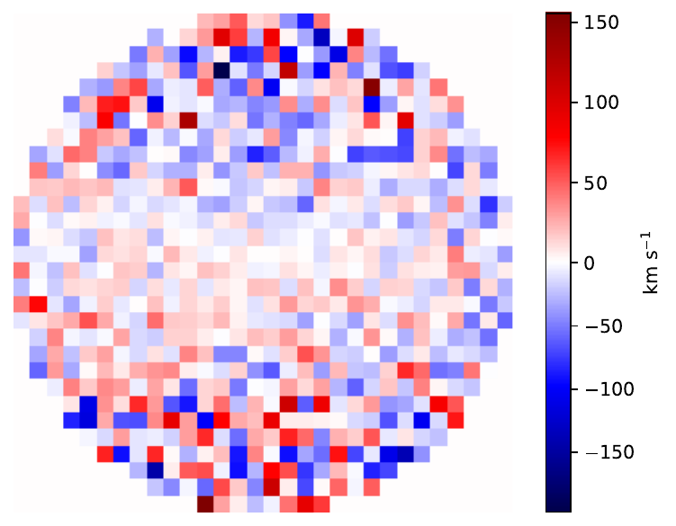 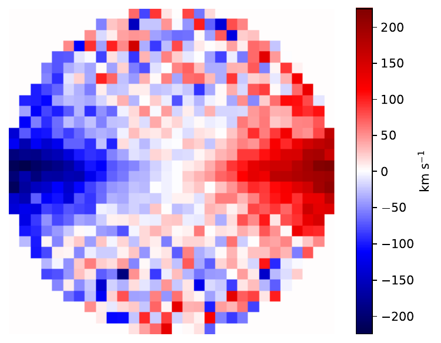 

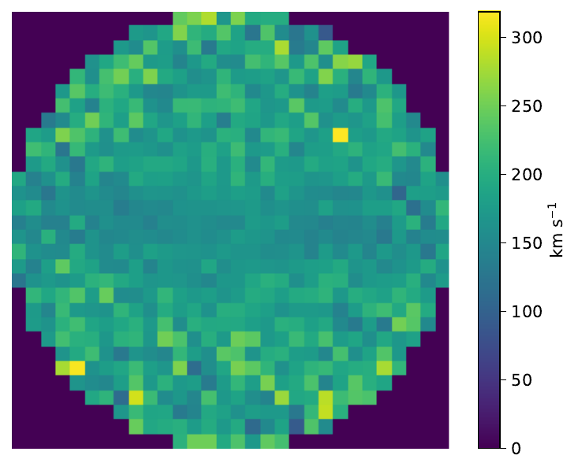 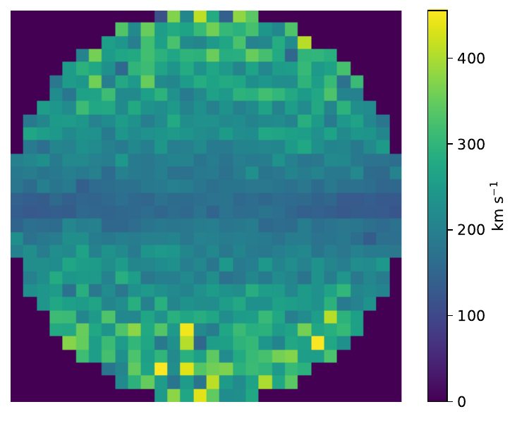 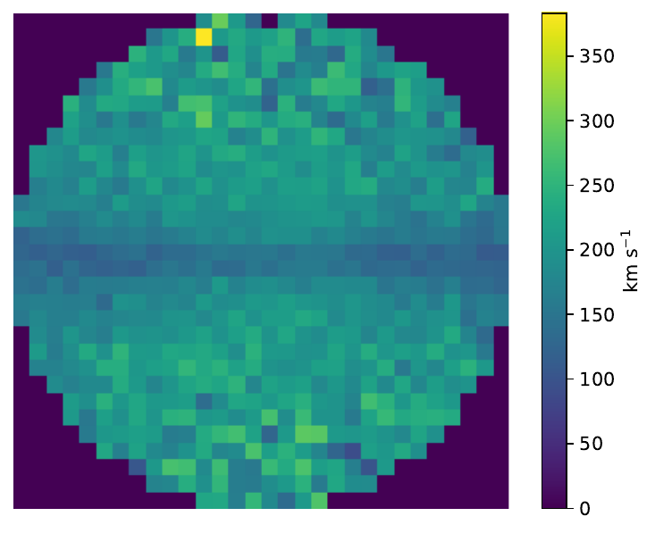

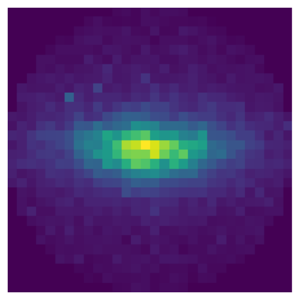 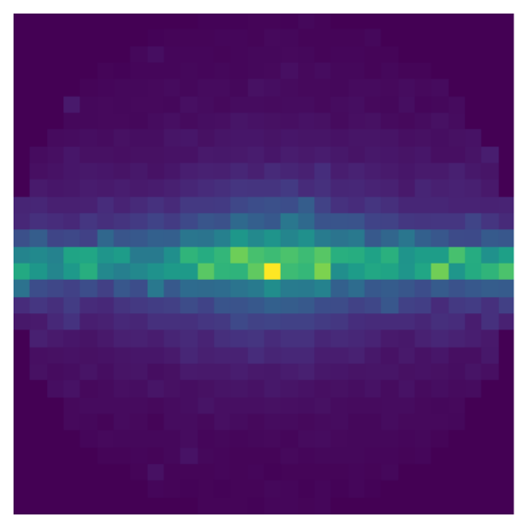 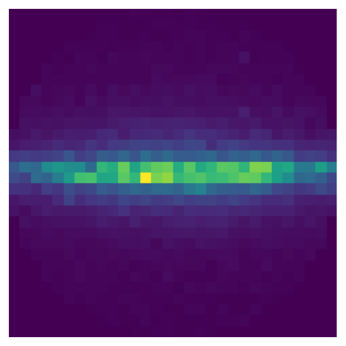
